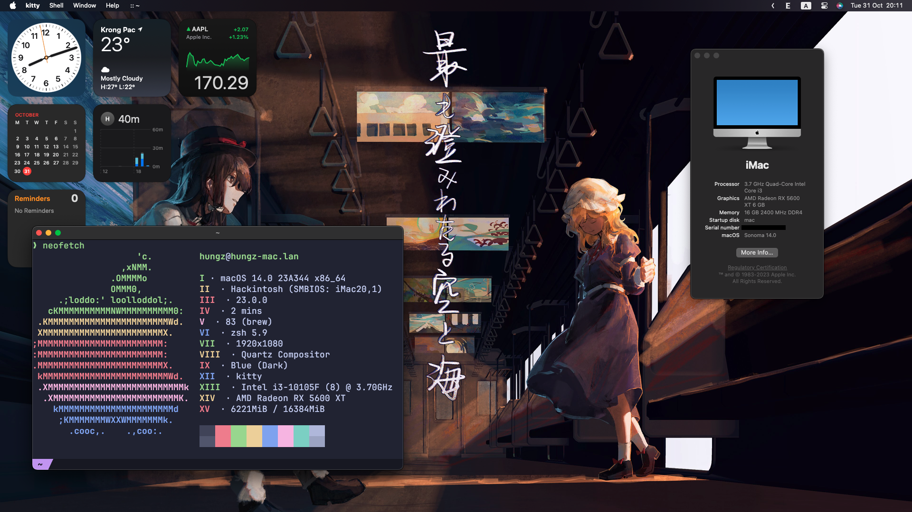
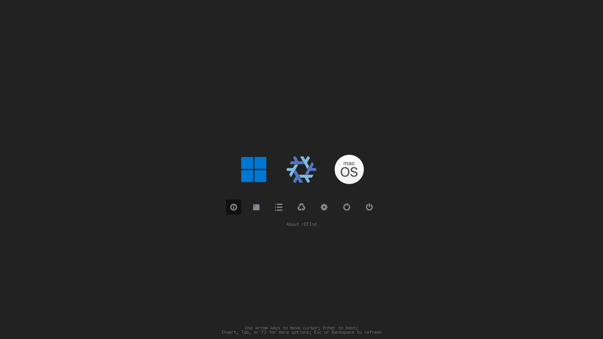
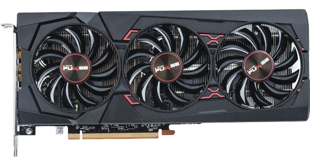
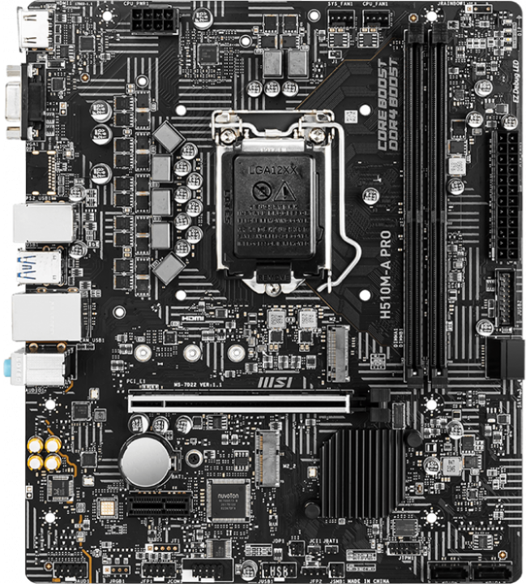
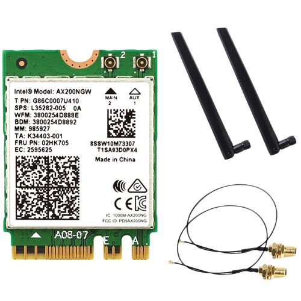

# My Hackintosh + rEFInd EFI pack

## Screenshot

 

### Triple boot rEFInd bootloader



## Specs ( low-end btw )

- **Intel i3 10105F**

 

- **AMD Sapphire RX 5600 XT ( Navi 10 )**  

 

- **MSI H510M-A PRO**

  - **m-ATX size**
  - **Audio: Realtek® ALC892/ ALC897 Codec**
  - **Socket: LGA 1200 (for Intel 10th and 11th Generation)**
  - **2x Dual-Channel DDR4 RAM (3200MHz max bus)**
  - **1 PCI-E x16**
  - **1 PCI-E x1**
  - **2 M.2 Slots**
  - **PCI-E Generation: 4.0 ( but currently running on 3.0 because the CPU
    lol )**
  - **4 SATA Slots**

   


- **2x Kingston Fury Beast 8GB (3200MHz but only runs at 2666MHz 💔)**  

   

- **Intel WiFi-6 AX 200**  
   

## UEFI Settings

### Disabled
  - **_Fast boot_**
  - **_Serial/COM Port_**
  - **_Parallel Port_**
  - **_Compatibility Support Module (CSM)_**
  - **_CFG Lock_**
  - **_Intel SGX_**
### Enabled
- <a id="secure-boot"></a>**_Secure Boot_**, following these guides from <a href="https://github.com/perez987/OpenCore-and-UEFI-Secure-Boot" target="_blank">perez987</a> and
  <a href="https://github.com/profzei/Matebook-X-Pro-2018/wiki/Enable-BIOS-Secure-Boot-with-OpenCore" target="_blank">profzei</a> 
 - **_Hyper-Threading_** 
 - **_AHCI SATA mode (always by default)_** 
 - **_VT-x, VT-d_** 
 - **_Execute Disable Bit_**

## What's inside this repository?

```
├── Boot/
│   ├── drivers_x64/
│   ├── icons/
│   ├── keys/
│   ├── themes/
│   ├── vars/
│   ├── BOOTx64.efi
│   ├── refind.conf
│   └── refind.conf-sample
├── Microsoft/
│   ├── Boot/
│   └── Recovery/
├── OC/
│   ├── ACPI/
│   ├── Drivers/
│   ├── Kexts/
│   ├── Resources/
│   ├── Tools/
│   ├── OpenCore.efi
│   └── config.plist
├── images/
│   ├── cpu.png
│   ├── mainboard.png
│   ├── ram.png
│   ├── screenshot.png
│   ├── vga.png
│   └── wifi_card.png
├── secure_boot_certs/
│   ├── KEK.auth
│   ├── PK.auth
│   └── db.auth
├── tools
│   └── shellx64.efi
└── README.md

```

### _Boot_

- _BOOTx64.efi_ : rEFInd EFI boot binary
- _drivers_x64/_ : rEFInd filesystem drivers
- _icons/_ : default icons
- _vars/_ : rEFInd boot variables
- _themes/_: rEFInd theme folder, currently contains [rEFInd-minimal](https://github.com/evanpurkhiser/rEFInd-minimal) and [refind-theme-regular](https://github.com/bobafetthotmail/refind-theme-regular) ( I'm using this )
- _refind.conf & refind.conf-sample_ : rEFInd configuration file

### _Microsoft_

- _BOOT/_ : Windows Boot Manager location
- _Recovery_/ : Windows Recovery folder

### OC

- _ACPI/_ : OpenCore ACPI, contained in `OpenCorePkg` package
- _Drivers/_ : OpenCore drivers, also inside `OpenCorePkg` package
- _Resources/_ : OpenCore graphic boot resources (images,audios,fonts,...), currently I'm using <a href="https://github.com/blackosx/BsxM1" target="_blank"> BlackOSX M1</a>
- _Kexts/_ : Kernel extensions:
  - <a href="https://github.com/OpenIntelWireless/itlwm/releases"
    target="_blank">AirportItlwm.kext<a/>
  - <a href="https://github.com/acidanthera/AppleALC/releases"
    target="_blank">AppleALC.kext</a>
  - <a href="https://github.com/OpenIntelWireless/IntelBluetoothFirmware/releases/tag/v2.3.0" target="_blank">IntelBluetoothFirmware.kext & IntelBTPactcher.kext</a>
  - <a href="https://github.com/acidanthera/BrcmPatchRAM/releases/tag/2.6.8"
    target="_blank">BlueToolFixup.kext</a>
  - <a href="https://github.com/acidanthera/IntelMausi/releases"
    target="_blank">IntelMausi.kext</a>
  - <a href="https://github.com/acidanthera/Lilu/releases"
    target="_blank">Lilu.kext</a>
  - <a href="https://github.com/acidanthera/NVMeFix/releases/tag/1.1.1"
    target="_blank">NVMeFix.kext</a>
  - <a href="https://github.com/acidanthera/VirtualSMC/releases"
    target="_blank">SMCProcessor.kext, SMCSuprtIO.kext, VirtualSMC.kext</a>
  - <a href="https://github.com/USBToolBox/kext/releases/tag/1.1.1"
    target="_blank">USBToolBox.kext</a>
  - <a href="https://github.com/USBToolBox/tool" target="_blank">UTBMap.kext, generated from this tool</a>
  - <a
    href="https://github.com/acidanthera/WhateverGreen/releases" target="_blank">WhateverGreen.kext</a>
- _Tools/_: OpenCore tools, already inside `OpenCorePkg` package
- _config.plist_: OpenCore configuration file
    - SMBIOS: **iMac 20,1**
    - Secure Boot Model: **j187f**
- _OpenCore.efi_: OpenCore EFI binary boot file
### _secure_boot_certs_
- Generated secure boot files: `db.auth` `KEK.auth` and `PK.auth`
- [Instructions already mentioned in UEFI Settings](#secure-boot)
### _tools_
- Only consists rEFInd UEFI Shell ( shellx64.efi )
### _images_
Well the named told it all, it just contains images for this markdown : )

#### Also thanks [@HighDelay](https://github.com/HighDelay) a lot for helping me build this EFI and fixing errors!
